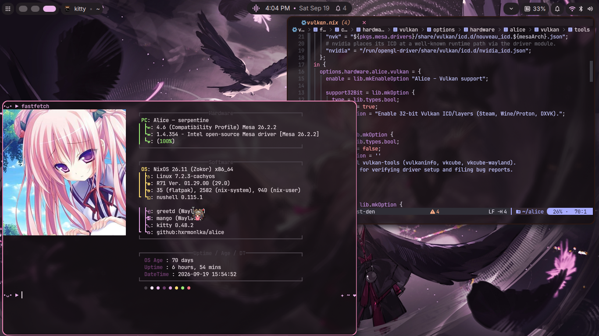
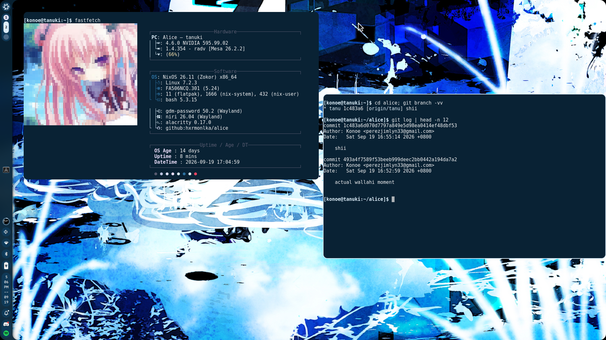

<h1 align="center">
⏾ Alice .✦ ݁˖
</h1>

<p align="center">
  
  
  
</p>
<details>
<summary><b>What is this?</b></summary>
<ul>
<li> It's my NixOS dotfiles. It's not really focused on ricing since it's genuinely just a NixOS dotfiles. </li>
<li>This one's more focused on functionality than aesthetics, though, I <i>could</i> maybe think of that soon. </li>
</ul>
</details>
<details>
<summary><b>Where is Epsilon?</b></summary>
As of now, Epsilon is still in development. It's not ready to be applied in Alice yet. :(
The name's just there because my humour sucks.
</details>
<details>
<summary><b>Where can I learn more about it?</b></summary>
You can learn more about it by going through the <a href="https://github.com/hxrmonlka/alice/wiki">documentation</a>. (Though this is still being developed.)
</details>

## Introduction
Alice is built upon the [Dendritic pattern](https://discourse.nixos.org/t/the-dendritic-pattern/61271); it uses vic's import-tree to practically autoload whatever Nix modules is inside the `modules` directory. flake-parts is used to break my Nix dotfiles into small flakes, basically.

Each hosts are managed by collaborators who use Alice's dotfiles:
- `tanuki` is managed by [seiryouden](https://github.com/seiryouden).
- `serpentine` is managed by [hxrmonlka](https://github.com/hxrmonlka), and [yixanni](https://github.com/yixanni).
- While `aux-mini` is waiting for its new owner.
### Branches
`tanu` and `test-den` merges together daily, but most of the time `test-den` updates `tanu` while `main` can only accept when the dotfiles are stable. (Which takes a while.)

`test-den` still needs to be clean without any force pushes resulting into conflicts, mostly. That's why `tanu` receives them instead, it's a clear ground between the two.
### Gallery
Current look of each hosts in Alice:

| Serpentine                                                        | Tanuki                                                        |
| :---------------------------------------------------------------- | :------------------------------------------------------------ |
|  |  |

Each hosts have their kind of aesthetics, hardware settings, etc. Depending on the set up, they are also used for specific fields. `serpentine` is made entirely for daily-basis activities, `tanuki` is slightly more for the gaming side.
## Structure
This is a basic example of what Alice currently contains, preferably focusing on the important part. 

```
.
├── flake.nix              # mkFlake + import-tree ./modules
├── flake.lock
├── modules/
│   ├── parts.nix          # flake.custom.* namespace declarations
│   ├── common/             # Shared NixOS config (boot, fonts, services, nix settings)
│   │   └── home/            # Shared Home Manager config
│   ├── cursor-themes.nix
│   ├── gaming/              # Gaming packages and settings
│   ├── hardware/            # Hardware, driver, and hardware-profile modules
│   ├── home/
│   │   ├── alice/            # Home Manager modules for user alice
│   │   └── konoe/            # Home Manager modules for user konoe
│   └── hosts/
│       ├── serpentine/       # hxrmonlka, yixanni
│       ├── tanuki/           # seiryouden
│       ├── aux-mini/         # unassigned
│       └── dev-shell.nix     # `nix develop` VM testing shell
└── scripts/                  # Git hook install and settings sync scripts
```

`modules/parts.nix` declares the namespace each area writes into:

| Namespace                      | Source                     | Description                         |
| :----------------------------- | :------------------------- | :---------------------------------- |
| `flake.custom.serpentine`      | `modules/hosts/serpentine` | System-level config for Serpentine  |
| `flake.custom.tanuki`          | `modules/hosts/tanuki`     | System-level config for Tanuki      |
| `flake.custom.aux-mini`        | `modules/hosts/aux-mini`   | System-level config for aux-mini    |
| `flake.custom.alice`           | `modules/home/alice`       | Home Manager modules for user alice |
| `flake.custom.konoe`           | `modules/home/konoe`       | Home Manager modules for user konoe |
| `flake.custom.commonModules`   | `modules/common`           | Shared NixOS config                 |
| `flake.custom.home-common`     | `modules/common/home`      | Shared Home Manager config          |
| `flake.custom.hardwareModules` | `modules/hardware`         | Hardware and driver modules         |
## Getting Started
Prerequisites:
- Nix with the `flakes` and `nix-command` experimental features enabled.
- [`nh`](https://github.com/nix-community/nh), used for rebuilds.

Clone the repo and rebuild your system:
```bash
git clone --branch test-den https://github.com/hxrmonlka/alice.git
cd alice
nh os switch
```

Test a host in a disposable VM:
```bash
nix develop
build-vm <host>   # serpentine, tanuki, or aux-mini
```
## License
Alice is licensed under the [BSD 3-Clause License](LICENSE).
